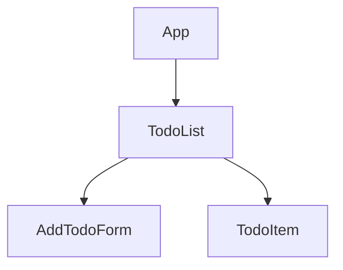

# Todo List App

## Component Tree + Data Flow

## Components

- **App** - Main container, no state
- **TodoList** - State: todos array
- **AddTodoForm** - State: inputValue, Props: onAddTodo
- **TodoItem** - State: completed, Props: task, onDelete

## Data Flow

- **Props Down**: task (TodoList → TodoItem)
- **Callbacks Up**: onAddTodo (AddTodoForm → TodoList), onDelete (TodoItem → TodoList)